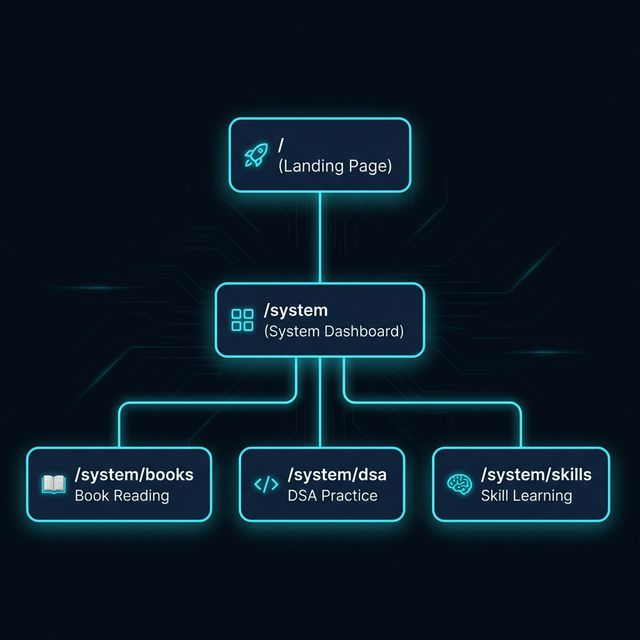
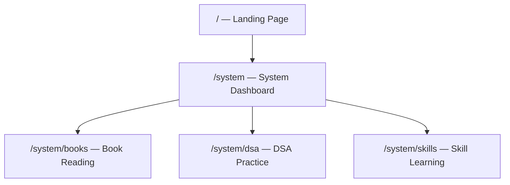
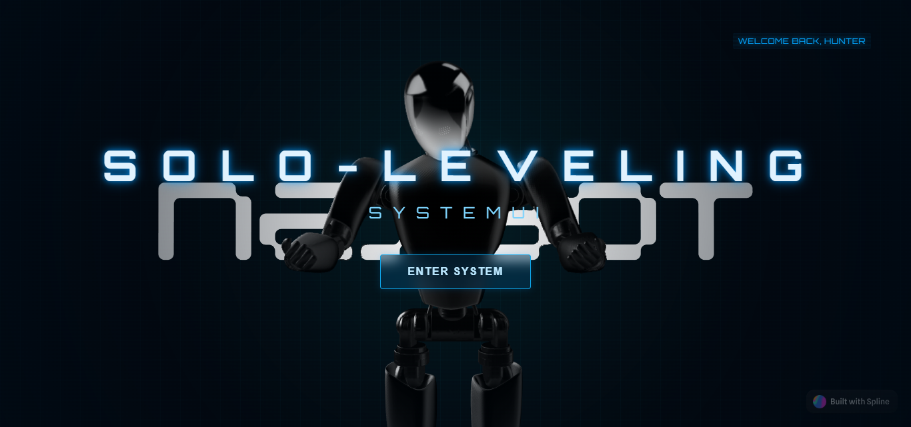
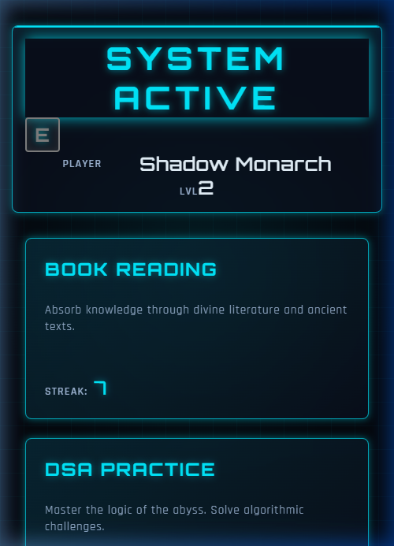
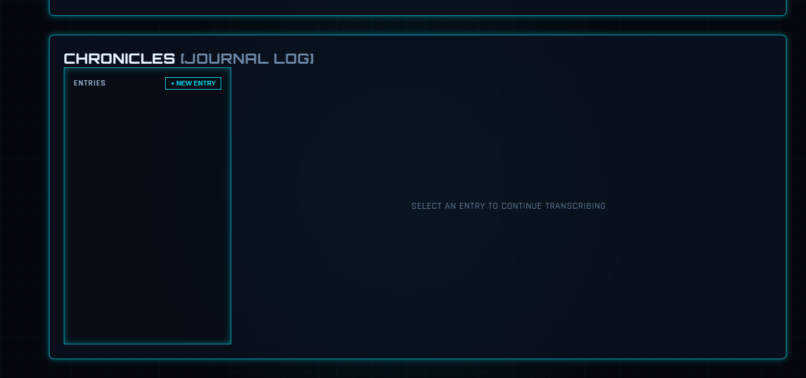

# Solo-Leveling System UI — Website Walkthrough

> A comprehensive visual and functional walkthrough of the entire Solo-Leveling System UI web application.

---

## Visual Sitemap

---

## 1. Landing Page

| Property | Value |
|----------|-------|
| **Route** | `/` |
| **Component** | `Landing` |
| **Purpose** | Entry point and first impression — immersive 3D hero with system branding |

### Features
- **3D Spline Robot** — Interactive hero element that tracks mouse cursor movement
- **Holographic Title** — "SOLO-LEVELING" in wide-kerned Orbitron font with neon cyan bloom
- **System Subtitle** — "SYSTEM UI" with digital styling
- **Glitch HUD Text** — "WELCOME BACK, HUNTER" in top-right with RGB split, slice displacement, and flicker animations
- **Enter System CTA** — Glassmorphism button with hover glow, navigates to `/system`
- **Dark Radial Background** — Gradient vignette over the 3D scene

### Components Used
- `<spline-viewer>` — 3D scene embed
- `<app-glitch-text>` — Holographic glitch text component
- Native HTML/SCSS for hero layout

### User Interactions
| Element | Action | Result |
|---------|--------|--------|
| Enter System button | Click | Navigates to `/system` |
| Enter System button | Hover | Cyan glow border + shadow intensifies |
| Spline Robot | Mouse move | 3D model follows cursor |

### Screenshots

### Video Walkthrough
📹 [Landing Walkthrough Recording](./media/landing/landing_walkthrough.webp)

---

## 2. System Dashboard

| Property | Value |
|----------|-------|
| **Route** | `/system` |
| **Component** | `SystemDashboard` (child of `System` shell) |
| **Purpose** | Central hub showing all modules, player stats, and active quests |

### Features
- **System Shell Header** — "SYSTEM ACTIVE" banner with rank badge (E), player name "Shadow Monarch", and level display (LVL 2)
- **Module Cards Grid** — 3-column responsive grid with holographic card panels:
  - **Book Reading** — Streak: 7, route `/system/books`
  - **DSA Practice** — Streak: 12, route `/system/dsa`
  - **Skill Learning** — Streak: 4, route `/system/skills`
- **Active Tasks Section** — Quest management panel with XP rewards
- **+ NEW QUEST Button** — Opens quest creation overlay
- **Quest Items** — Individual task blocks showing category, difficulty, XP, and completion button

### Components Used
- `<app-quest-item>` — Individual quest display
- `<app-quest-create-panel>` — Quest creation overlay
- System shell with `<router-outlet>`

### User Interactions
| Element | Action | Result |
|---------|--------|--------|
| Module Card | Click | Navigate to module route |
| Module Card | Hover | Lift animation + cyan glow border |
| + NEW QUEST | Click | Opens creation overlay |
| Done button | Click | Completes quest, awards XP |

### Screenshots

### Video Walkthrough
📹 [Dashboard Walkthrough Recording](./media/system/dashboard_walkthrough.webp)

---

## 3. Book Reading Module

| Property | Value |
|----------|-------|
| **Route** | `/system/books` |
| **Component** | `BooksComponent` |
| **Purpose** | Track reading progress, log pages, and journal thoughts |

### Features
- **Module Header Stats** — Current streak, best streak, total pages read
- **Activity Monitor (30D Heatmap)** — Color-coded 30-day activity grid (green = active, gray = inactive)
- **System Tracker (Reading Log)**:
  - Input: Current Book title
  - Input: Total Pages in book
  - Input: Pages Read Today
  - Circular progress ring showing completion percentage
  - SAVE LOG action button
- **Chronicles (Journal Log)**:
  - Entries sidebar with chronological list
  - + NEW ENTRY button
  - Full-width editor/transcription area

### Components Used
- `<app-module-shell>` — Shared module layout
- `<app-heatmap>` — Activity heatmap grid
- `<app-journal>` — Journal/chronicle component
- Custom reading tracker with SVG progress ring

### User Interactions
| Element | Action | Result |
|---------|--------|--------|
| Book title input | Type | Sets current book name |
| Pages input | Type | Updates progress ring in real-time |
| SAVE LOG | Click | Persists reading session to localStorage |
| + NEW ENTRY | Click | Creates new journal entry |
| Entry item | Click | Loads entry content into editor |
| Heatmap cell | Hover | Shows date tooltip |

### Screenshots

### Video Walkthrough
📹 [Books Module Recording](./media/books/books_walkthrough.webp)

---

## 4. DSA Practice Module

| Property | Value |
|----------|-------|
| **Route** | `/system/dsa` |
| **Component** | `DsaComponent` |
| **Purpose** | Track algorithm problem-solving progress across categories |

### Features
- **Module Header Stats** — Current streak, best solved count, total solved
- **Activity Monitor (30D Heatmap)** — Identical heatmap component tracking DSA practice
- **DSA Archive (System Tracker)**:
  - Category management with + ADD CATEGORY button
  - Topic tracking per category (e.g., Arrays, Graphs, DP)
  - Solved count per topic
  - Problem log entries
- **Chronicles (Journal Log)**:
  - Technical notes and solution breakdowns
  - Entry management sidebar

### Components Used
- `<app-module-shell>` — Shared module layout
- `<app-heatmap>` — Activity heatmap grid
- `<app-journal>` — Journal/chronicle component
- Custom DSA tracker with category/topic hierarchy

### User Interactions
| Element | Action | Result |
|---------|--------|--------|
| + ADD CATEGORY | Click | Creates new DSA category |
| Topic input | Type | Adds topic under category |
| Solved count | Update | Increments solved total and streak |
| + NEW ENTRY | Click | Creates journal entry for notes |
| Heatmap cell | Hover | Shows date and problem count |

### Video Walkthrough
📹 [DSA Module Recording](./media/dsa/dsa_walkthrough.webp)

---

## 5. Skill Learning Module

| Property | Value |
|----------|-------|
| **Route** | `/system/skills` |
| **Component** | `SkillsComponent` |
| **Purpose** | Track skill acquisition and mastery progress |

### Features
- **Module Header Stats** — Current streak, best streak, total skills tracked
- **Activity Monitor (30D Heatmap)** — Activity tracking for skill practice sessions
- **System Tracker (Skill Acquisition)**:
  - Skill name input: "Enter skill to master..."
  - INITIALIZE button to start tracking a new skill
  - Status display: "AWAITING DIRECTIVE" when empty
  - Skill progress cards once skills are added
- **Chronicles (Journal Log)**:
  - Learning notes and progress documentation
  - Entry management sidebar with + NEW ENTRY

### Components Used
- `<app-module-shell>` — Shared module layout
- `<app-heatmap>` — Activity heatmap grid
- `<app-journal>` — Journal/chronicle component
- Custom skill tracker with initialization flow

### User Interactions
| Element | Action | Result |
|---------|--------|--------|
| Skill input | Type | Sets skill name to master |
| INITIALIZE | Click | Creates new skill tracking card |
| Skill card | Click | Expands skill details |
| + NEW ENTRY | Click | Creates journal entry |
| Heatmap cell | Hover | Shows date tooltip |

### Video Walkthrough
📹 [Skills Module Recording](./media/skills/skills_walkthrough.webp)

---

## Shared Components Across Modules

| Component | Used In | Purpose |
|-----------|---------|---------|
| `<app-module-shell>` | Books, DSA, Skills | Consistent layout with header stats, heatmap, tracker, journal |
| `<app-heatmap>` | Books, DSA, Skills | 30-day activity monitor with color-coded intensity |
| `<app-journal>` | Books, DSA, Skills | Chronicle/journal with entry sidebar and editor |
| `<app-glitch-text>` | Landing | Holographic glitch text effect |
| `<app-quest-item>` | Dashboard | Individual quest display with XP |
| `<app-quest-create-panel>` | Dashboard | Quest creation overlay |
| System Shell | All `/system/*` | Header bar with player stats, rank badge, navigation |

---

## Technology Stack

| Layer | Technology |
|-------|-----------|
| Framework | Angular 19 (standalone components) |
| Styling | SCSS with custom system-theme tokens |
| 3D | Spline (landing page robot) |
| State | Angular Signals + localStorage persistence |
| Typography | Orbitron, Rajdhani (Google Fonts) |
| Animation | CSS keyframes + Angular animations |

---

## Design System

| Token | Value | Usage |
|-------|-------|-------|
| `$neon-cyan` | `#00d4ff` | Primary accent, borders, glows |
| `$bg-deep` | `#0a0e1a` | Page background |
| `$grid-line` | `rgba(0,212,255,0.1)` | Grid pattern overlays |
| `$glow-soft` | `0 0 10px rgba(0,212,255,0.3)` | Subtle glow effects |
| `$glow-strong` | `0 0 20px rgba(0,212,255,0.6)` | Intense hover glows |

---

*Generated automatically on 2026-02-26*